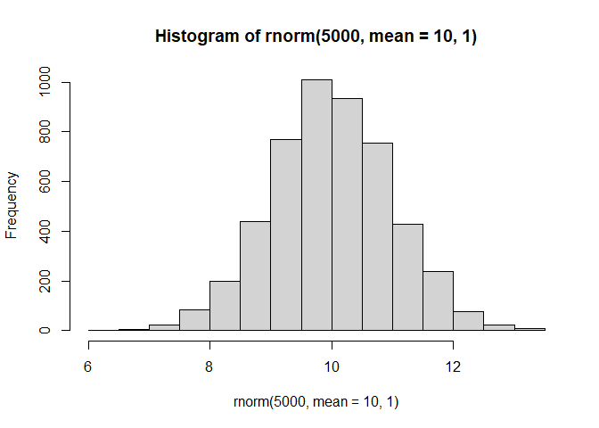
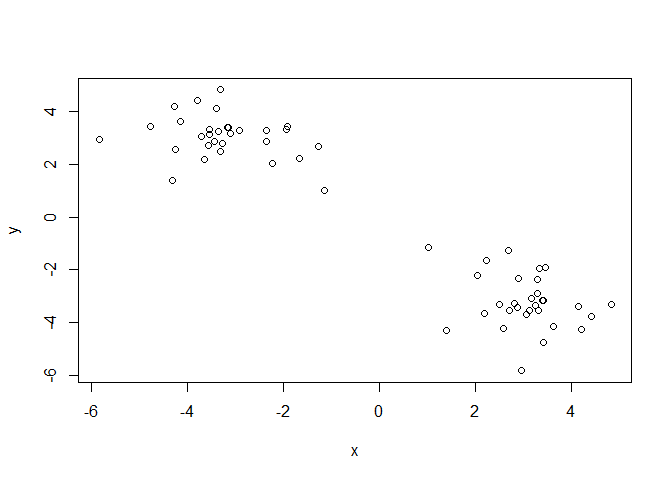
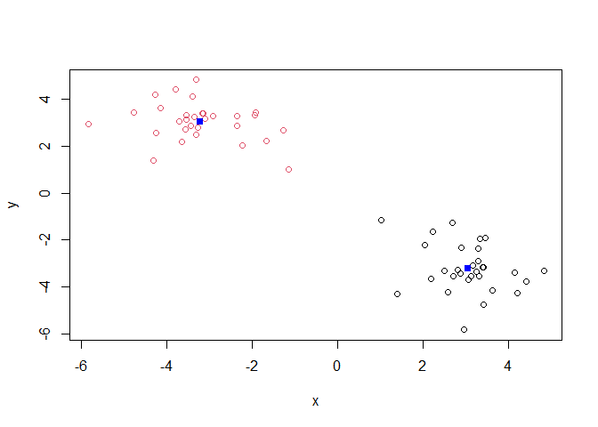
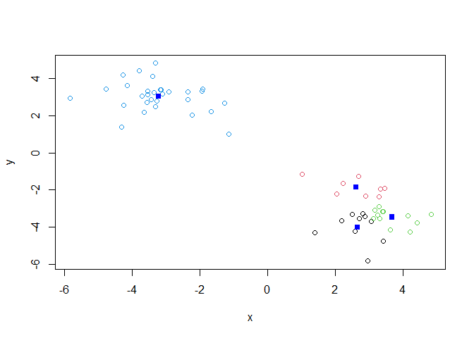
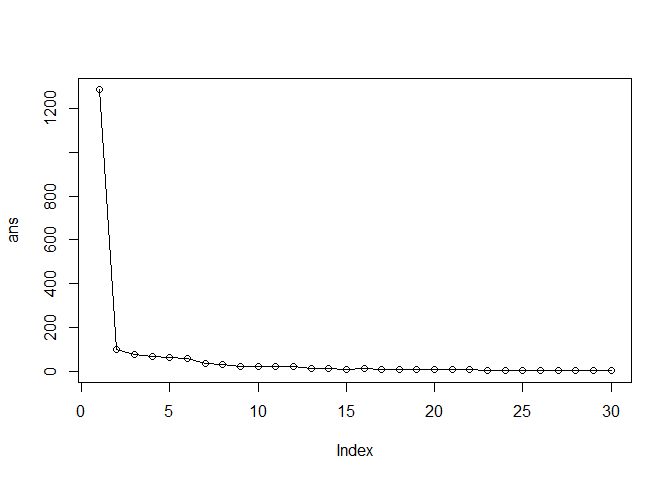
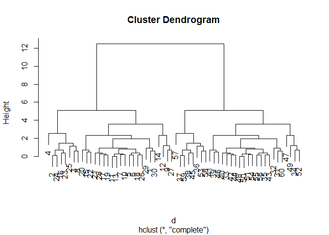
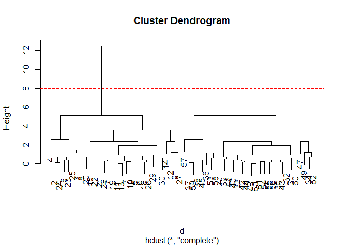
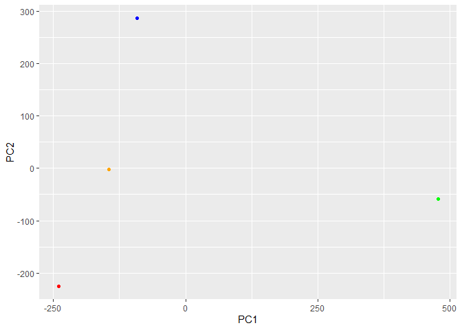
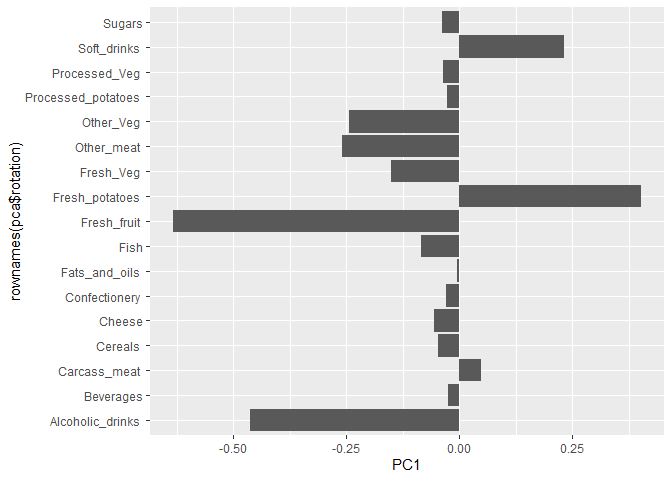

# Class 7: Machine Learning 1
Austin Teel (A17293709)

- [Background](#background)
- [K-means cluster](#k-means-cluster)
- [Hierarchical Clustering](#hierarchical-clustering)
- [PCA of UK food data](#pca-of-uk-food-data)
- [Spotting major differences and
  trends](#spotting-major-differences-and-trends)
  - [Pairs plot and heatmaps](#pairs-plot-and-heatmaps)
- [PCA to the rescue](#pca-to-the-rescue)

## Background

Today we will begin our exploration of some important machine learning
methods, namely **clustering** and **dimensionality reduction**

Let’s make up some input data for clustering where we know what the
natural “clusters” are.

The function `rnorm()` can be useful here.

``` r
hist(rnorm(5000, mean=10, 1))
```



> Q. Generate 30 random numbers centered at +3 and another 30 centered
> at -3

``` r
tmp <- c(rnorm(30,mean=3),
         rnorm(30,-3))
x <- cbind(x=tmp, y=rev(tmp))
plot(x)
```



## K-means cluster

The main function in “base R” for K-means clustering is called
`kmeans()`:

``` r
km <- kmeans(x,centers=2)
km
```

    K-means clustering with 2 clusters of sizes 30, 30

    Cluster means:
              x         y
    1  3.062573 -3.217670
    2 -3.217670  3.062573

    Clustering vector:
     [1] 1 1 1 1 1 1 1 1 1 1 1 1 1 1 1 1 1 1 1 1 1 1 1 1 1 1 1 1 1 1 2 2 2 2 2 2 2 2
    [39] 2 2 2 2 2 2 2 2 2 2 2 2 2 2 2 2 2 2 2 2 2 2

    Within cluster sum of squares by cluster:
    [1] 50.17339 50.17339
     (between_SS / total_SS =  92.2 %)

    Available components:

    [1] "cluster"      "centers"      "totss"        "withinss"     "tot.withinss"
    [6] "betweenss"    "size"         "iter"         "ifault"      

> Q. What component of the results object details the cluster sizes?

``` r
km$size
```

    [1] 30 30

> Q. What component of the results object details the cluster centers?

``` r
km$centers
```

              x         y
    1  3.062573 -3.217670
    2 -3.217670  3.062573

> Q. What component of the results object details the cluster membership
> vector (i.e. our main result of which points lie in which cluster)?

``` r
km$cluster
```

     [1] 1 1 1 1 1 1 1 1 1 1 1 1 1 1 1 1 1 1 1 1 1 1 1 1 1 1 1 1 1 1 2 2 2 2 2 2 2 2
    [39] 2 2 2 2 2 2 2 2 2 2 2 2 2 2 2 2 2 2 2 2 2 2

> Q. Plot our clustering results with points colored by cluster and also
> add the cluster centers as new points colored blue?

``` r
plot(x, col=km$cluster)
points(km$centers, col="blue", pch=15)
```



> Q. run `kmeans` again and this time produce 4 clusters 9and call your
> result object `k4`) and make a results figure like above?

``` r
k4 <- kmeans(x,centers=4)
k4
```

    K-means clustering with 4 clusters of sizes 10, 8, 12, 30

    Cluster means:
              x         y
    1  2.660293 -4.006380
    2  2.623892 -1.851606
    3  3.690260 -3.471121
    4 -3.217670  3.062573

    Clustering vector:
     [1] 3 2 2 2 1 3 3 2 1 3 3 1 3 1 3 2 1 3 1 3 1 3 2 2 2 3 1 1 1 3 4 4 4 4 4 4 4 4
    [39] 4 4 4 4 4 4 4 4 4 4 4 4 4 4 4 4 4 4 4 4 4 4

    Within cluster sum of squares by cluster:
    [1]  8.586036  6.348092  5.433006 50.173385
     (between_SS / total_SS =  94.5 %)

    Available components:

    [1] "cluster"      "centers"      "totss"        "withinss"     "tot.withinss"
    [6] "betweenss"    "size"         "iter"         "ifault"      

``` r
plot(x, col=k4$cluster)
points(k4$centers, col="blue", pch=15)
```



The metric

``` r
km$tot.withinss
```

    [1] 100.3468

``` r
k4$tot.withinss
```

    [1] 70.54052

> Q. Let’s try different number of K (centers) from 1 to 30 and see what
> the best result is?

``` r
ans <- NULL
for(i in 1:30){
ans <- c(ans, kmeans(x, centers=i)$tot.withinss)
}
```

``` r
plot(ans, type="o")
```



**Key-pont:** K-means will impose a clustering structure on your data
even if it is not there - it will always give you the answer you asked
for even if that answer is silly. With `tot.withinss` you are able to
see that the higher your centers amount there are are the lower your
value will be which means the spreads will be and the tighter the
clusters will be.

## Hierarchical Clustering

The main function for Hierarchical Clustering is called `hclust()`.

Unlike `kmeans()` (which does all of the work for you) you can’t just
pass `hclust()` our raw data input. It needs a “distance matrix” like
the one returned from the `dist()` function.

``` r
d <- dist(x)
hc <- hclust(d)
plot(hc)
```



To extract our cluster membership vector from a `hclust()` result object
we have to “cut” our tree at a given height to yield seperate
“groups”/“branches”.

``` r
plot(hc)
abline(h=8, col="red", lty=2)
```



To do this we use the `cutree()` function on our `hclust()` object:

``` r
grps <- cutree(hc, h=8)
grps
```

     [1] 1 1 1 1 1 1 1 1 1 1 1 1 1 1 1 1 1 1 1 1 1 1 1 1 1 1 1 1 1 1 2 2 2 2 2 2 2 2
    [39] 2 2 2 2 2 2 2 2 2 2 2 2 2 2 2 2 2 2 2 2 2 2

``` r
table(grps,
km$cluster)
```

        
    grps  1  2
       1 30  0
       2  0 30

## PCA of UK food data

Import the dataset of food consumption in the UK:

``` r
url <- "https://tinyurl.com/UK-foods"
x <- read.csv(url)
x
```

                         X England Wales Scotland N.Ireland
    1               Cheese     105   103      103        66
    2        Carcass_meat      245   227      242       267
    3          Other_meat      685   803      750       586
    4                 Fish     147   160      122        93
    5       Fats_and_oils      193   235      184       209
    6               Sugars     156   175      147       139
    7      Fresh_potatoes      720   874      566      1033
    8           Fresh_Veg      253   265      171       143
    9           Other_Veg      488   570      418       355
    10 Processed_potatoes      198   203      220       187
    11      Processed_Veg      360   365      337       334
    12        Fresh_fruit     1102  1137      957       674
    13            Cereals     1472  1582     1462      1494
    14           Beverages      57    73       53        47
    15        Soft_drinks     1374  1256     1572      1506
    16   Alcoholic_drinks      375   475      458       135
    17      Confectionery       54    64       62        41

> Q1. How many rows and columns are in your new data frame named x? What
> R functions could you use to answer this questions?

``` r
nrow(x)
```

    [1] 17

``` r
ncol(x)
```

    [1] 5

``` r
#or
dim(x)
```

    [1] 17  5

One solution to set the row names is to do it by hand…

``` r
rownames(x) <- x[,1]
x
```

                                          X England Wales Scotland N.Ireland
    Cheese                           Cheese     105   103      103        66
    Carcass_meat              Carcass_meat      245   227      242       267
    Other_meat                  Other_meat      685   803      750       586
    Fish                               Fish     147   160      122        93
    Fats_and_oils            Fats_and_oils      193   235      184       209
    Sugars                           Sugars     156   175      147       139
    Fresh_potatoes          Fresh_potatoes      720   874      566      1033
    Fresh_Veg                    Fresh_Veg      253   265      171       143
    Other_Veg                    Other_Veg      488   570      418       355
    Processed_potatoes  Processed_potatoes      198   203      220       187
    Processed_Veg            Processed_Veg      360   365      337       334
    Fresh_fruit                Fresh_fruit     1102  1137      957       674
    Cereals                        Cereals     1472  1582     1462      1494
    Beverages                     Beverages      57    73       53        47
    Soft_drinks                Soft_drinks     1374  1256     1572      1506
    Alcoholic_drinks      Alcoholic_drinks      375   475      458       135
    Confectionery            Confectionery       54    64       62        41

To remove the first column I can use the minus index trick

``` r
x <- x[,-1]
x
```

                        England Wales Scotland N.Ireland
    Cheese                  105   103      103        66
    Carcass_meat            245   227      242       267
    Other_meat              685   803      750       586
    Fish                    147   160      122        93
    Fats_and_oils           193   235      184       209
    Sugars                  156   175      147       139
    Fresh_potatoes          720   874      566      1033
    Fresh_Veg               253   265      171       143
    Other_Veg               488   570      418       355
    Processed_potatoes      198   203      220       187
    Processed_Veg           360   365      337       334
    Fresh_fruit            1102  1137      957       674
    Cereals                1472  1582     1462      1494
    Beverages                57    73       53        47
    Soft_drinks            1374  1256     1572      1506
    Alcoholic_drinks        375   475      458       135
    Confectionery            54    64       62        41

A better way to do this is to set the row names of the first column with
`read.csv()`

``` r
x <- read.csv(url, row.names=1)
x
```

                        England Wales Scotland N.Ireland
    Cheese                  105   103      103        66
    Carcass_meat            245   227      242       267
    Other_meat              685   803      750       586
    Fish                    147   160      122        93
    Fats_and_oils           193   235      184       209
    Sugars                  156   175      147       139
    Fresh_potatoes          720   874      566      1033
    Fresh_Veg               253   265      171       143
    Other_Veg               488   570      418       355
    Processed_potatoes      198   203      220       187
    Processed_Veg           360   365      337       334
    Fresh_fruit            1102  1137      957       674
    Cereals                1472  1582     1462      1494
    Beverages                57    73       53        47
    Soft_drinks            1374  1256     1572      1506
    Alcoholic_drinks        375   475      458       135
    Confectionery            54    64       62        41

> Q2. Which approach to solving the ‘row-names problem’ mentioned above
> do you prefer and why? Is one approach more robust than another under
> certain circumstances?

## Spotting major differences and trends

Is difficult even in this wee 17D dataset…

``` r
barplot(as.matrix(x), beside=T, col=rainbow(nrow(x)))
```


``` r
barplot(as.matrix(x), beside=F, col=rainbow(nrow(x)))
```


### Pairs plot and heatmaps

``` r
pairs(x, col=rainbow(nrow(x)), pch=16)
```


``` r
library(pheatmap)

pheatmap( as.matrix(x) )
```


## PCA to the rescue

The main PCA function in “base R” is called `prcomp()`. This function
wants the transpose of our food data as input (i.e. the foods as columns
and the countries as rows).

``` r
pca <- prcomp(t(x))
```

``` r
summary(pca)
```

    Importance of components:
                                PC1      PC2      PC3       PC4
    Standard deviation     324.1502 212.7478 73.87622 3.176e-14
    Proportion of Variance   0.6744   0.2905  0.03503 0.000e+00
    Cumulative Proportion    0.6744   0.9650  1.00000 1.000e+00

``` r
attributes(pca)
```

    $names
    [1] "sdev"     "rotation" "center"   "scale"    "x"       

    $class
    [1] "prcomp"

To make one of the main PCA results figures we turn to `pca$x` the
scores along our new PCs. This is called “PC plot” or “score plot:
or”ordination plot” …

``` r
pca$x
```

                     PC1         PC2        PC3           PC4
    England   -144.99315   -2.532999 105.768945 -4.894696e-14
    Wales     -240.52915 -224.646925 -56.475555  5.700024e-13
    Scotland   -91.86934  286.081786 -44.415495 -7.460785e-13
    N.Ireland  477.39164  -58.901862  -4.877895  2.321303e-13

``` r
my_cols <- c("orange","red","blue","green")
```

``` r
library(ggplot2)

ggplot(pca$x)+
  aes(PC1,PC2)+
  geom_point(col=my_cols)
```



The second major resuly figure is called a “loadings plot” or “variable
contributions plot” or “weight plot”.

``` r
ggplot(pca$rotation)+
  aes(PC1, rownames(pca$rotation)) +
  geom_col()
```


