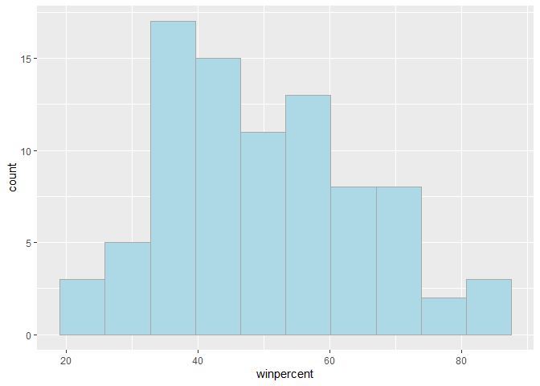
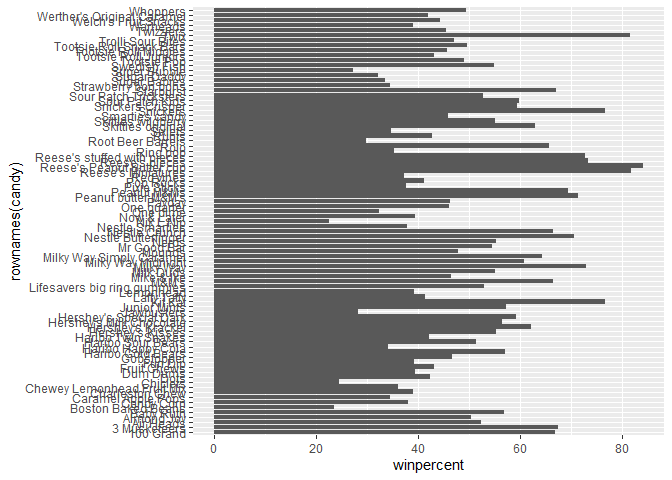
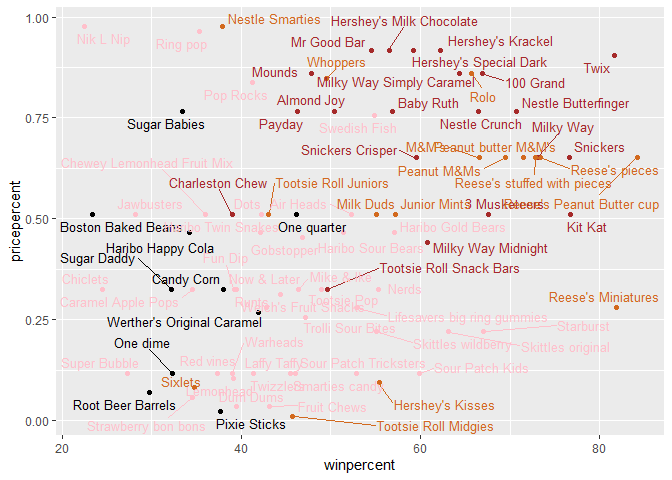
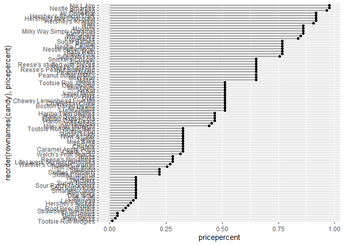
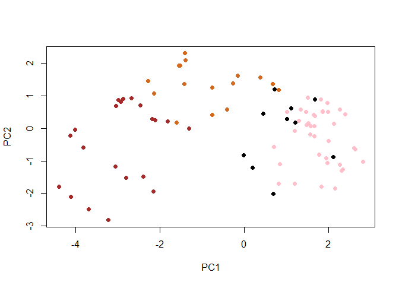
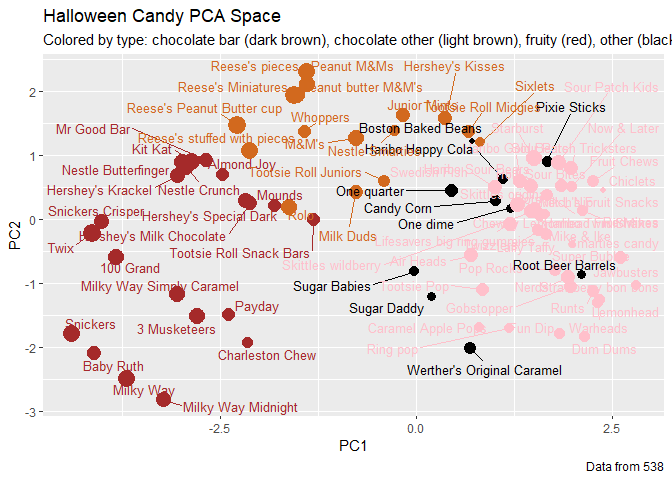
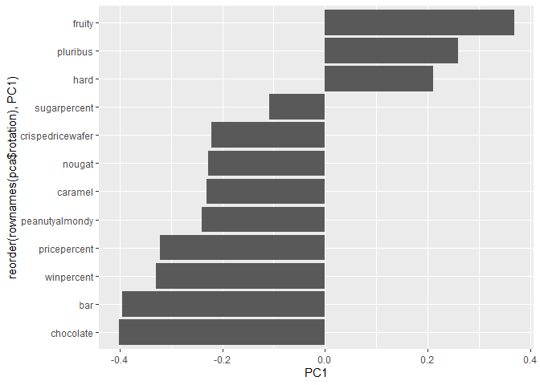

# Class 9: Candy Mini-Project
Austin Teel (A17293709)

- [Background](#background)
- [Leearning objectives](#leearning-objectives)
- [Importing Candy Data](#importing-candy-data)
- [What is in the data set](#what-is-in-the-data-set)
- [What is your favorite candy](#what-is-your-favorite-candy)
  - [Exploratory Analysis](#exploratory-analysis)
  - [Overall candy Rankings](#overall-candy-rankings)
  - [Time to add some useful color](#time-to-add-some-useful-color)
  - [Taking a loof at pricepercent](#taking-a-loof-at-pricepercent)
- [Optional making the graph look
  better.](#optional-making-the-graph-look-better)
  - [Exploring the correlation
    structure](#exploring-the-correlation-structure)
  - [Principle Component Analysis](#principle-component-analysis)
  - [Summary](#summary)

## Background

We will be looking at a candy data set of the top rated candy and answer
questions tghat we find after exploring the data.

## Leearning objectives

The learning objective are to make scatterplots that have`ggrepel()`
labels on scatter plots as well as `plotly()`. We also must interperate
correlations throght relationships of the variables as well as comparing
through PCA.

## Importing Candy Data

We must import the csv file first.

``` r
candy <- read.csv("candy-data.csv", row.names = 1)

head(candy)
```

                 chocolate fruity caramel peanutyalmondy nougat crispedricewafer
    100 Grand            1      0       1              0      0                1
    3 Musketeers         1      0       0              0      1                0
    One dime             0      0       0              0      0                0
    One quarter          0      0       0              0      0                0
    Air Heads            0      1       0              0      0                0
    Almond Joy           1      0       0              1      0                0
                 hard bar pluribus sugarpercent pricepercent winpercent
    100 Grand       0   1        0        0.732        0.860   66.97173
    3 Musketeers    0   1        0        0.604        0.511   67.60294
    One dime        0   0        0        0.011        0.116   32.26109
    One quarter     0   0        0        0.011        0.511   46.11650
    Air Heads       0   0        0        0.906        0.511   52.34146
    Almond Joy      0   1        0        0.465        0.767   50.34755

# What is in the data set

> Q1. How many different candy types are in this dataset?

``` r
nrow(candy)
```

    [1] 85

There are 85 candy types in the data this is found through our `nrow`
function.

> Q2. How many fruity candy types are in the dataset?

``` r
sum(candy$fruity)
```

    [1] 38

There are 38 fruity candies in the data set.

# What is your favorite candy

``` r
candy[candy$competitorname == "3 Musketeers", ]$winpercent
```

    numeric(0)

> Q3. What is your favorite candy (other than Twix) in the dataset and
> what is it’s winpercent value?

My favorite candy is 3 Musketeers and as seen above the win percent of
this candy is 67.60294.

> Q4. What is the winpercent value for “Kit Kat”?

``` r
candy[candy$competitorname == "Kit Kat", ]$winpercent
```

    numeric(0)

The win percent of kit cat is 76.7686 as seen above.

> Q5. What is the winpercent value for “Tootsie Roll Snack Bars”?

``` r
candy[candy$competitorname == "Tootsie Roll Snack Bars", ]$winpercent
```

    numeric(0)

The win percent of Tootsie Roll Snack Bars is 49.6535.

``` r
library("skimr")
skim(candy)
```

|                                                  |       |
|:-------------------------------------------------|:------|
| Name                                             | candy |
| Number of rows                                   | 85    |
| Number of columns                                | 12    |
| \_\_\_\_\_\_\_\_\_\_\_\_\_\_\_\_\_\_\_\_\_\_\_   |       |
| Column type frequency:                           |       |
| numeric                                          | 12    |
| \_\_\_\_\_\_\_\_\_\_\_\_\_\_\_\_\_\_\_\_\_\_\_\_ |       |
| Group variables                                  | None  |

Data summary

**Variable type: numeric**

| skim_variable | n_missing | complete_rate | mean | sd | p0 | p25 | p50 | p75 | p100 | hist |
|:---|---:|---:|---:|---:|---:|---:|---:|---:|---:|:---|
| chocolate | 0 | 1 | 0.44 | 0.50 | 0.00 | 0.00 | 0.00 | 1.00 | 1.00 | ▇▁▁▁▆ |
| fruity | 0 | 1 | 0.45 | 0.50 | 0.00 | 0.00 | 0.00 | 1.00 | 1.00 | ▇▁▁▁▆ |
| caramel | 0 | 1 | 0.16 | 0.37 | 0.00 | 0.00 | 0.00 | 0.00 | 1.00 | ▇▁▁▁▂ |
| peanutyalmondy | 0 | 1 | 0.16 | 0.37 | 0.00 | 0.00 | 0.00 | 0.00 | 1.00 | ▇▁▁▁▂ |
| nougat | 0 | 1 | 0.08 | 0.28 | 0.00 | 0.00 | 0.00 | 0.00 | 1.00 | ▇▁▁▁▁ |
| crispedricewafer | 0 | 1 | 0.08 | 0.28 | 0.00 | 0.00 | 0.00 | 0.00 | 1.00 | ▇▁▁▁▁ |
| hard | 0 | 1 | 0.18 | 0.38 | 0.00 | 0.00 | 0.00 | 0.00 | 1.00 | ▇▁▁▁▂ |
| bar | 0 | 1 | 0.25 | 0.43 | 0.00 | 0.00 | 0.00 | 0.00 | 1.00 | ▇▁▁▁▂ |
| pluribus | 0 | 1 | 0.52 | 0.50 | 0.00 | 0.00 | 1.00 | 1.00 | 1.00 | ▇▁▁▁▇ |
| sugarpercent | 0 | 1 | 0.48 | 0.28 | 0.01 | 0.22 | 0.47 | 0.73 | 0.99 | ▇▇▇▇▆ |
| pricepercent | 0 | 1 | 0.47 | 0.29 | 0.01 | 0.26 | 0.47 | 0.65 | 0.98 | ▇▇▇▇▆ |
| winpercent | 0 | 1 | 50.32 | 14.71 | 22.45 | 39.14 | 47.83 | 59.86 | 84.18 | ▃▇▆▅▂ |

Q6. Is there any variable/column that looks to be on a different scale
to the majority of the other columns in the dataset?

The variable that is different is the winpercent column due to the fact
that instead of 0-1 it is out of 100%.

Q7. What do you think a zero and one represent for the `candy$chocolate`
column?

The zero and the one represent if that candy has chocolate. zero

## Exploratory Analysis

``` r
hist(candy$winpercent, breaks=8)
```


``` r
library(ggplot2)
ggplot(candy)+
  aes(winpercent)+
geom_histogram(bins=10, col="darkgray", fill="lightblue")
```



> Q8. Plot a histogram of winpercent values using both base R an
> ggplot2.

See graphs above.

> Q9. Is the distribution of winpercent values symmetrical?

The distribution of winpercent values is not symmetrical and it is
skewed to the right.

> Q10. Is the center of the distribution above or below 50%?

``` r
mean(candy$winpercent)
```

    [1] 50.31676

``` r
median(candy$winpercent)
```

    [1] 47.82975

The center of the distribution mean wise is 50.3% while the median win
percent is 47.8%

> Q11. On average is chocolate candy higher or lower ranked than fruit
> candy?

``` r
chocolate_win <- candy$winpercent[as.logical(candy$chocolate)]


fruity_win <- candy$winpercent[as.logical(candy$fruity)]

mean(chocolate_win)
```

    [1] 60.92153

``` r
mean(fruity_win)
```

    [1] 44.11974

On average the chocolate candy is ranked higher than fruity candy in the
average win percent.

> Q12. Is this difference statistically significant?

``` r
t.test(chocolate_win,fruity_win)
```


        Welch Two Sample t-test

    data:  chocolate_win and fruity_win
    t = 6.2582, df = 68.882, p-value = 2.871e-08
    alternative hypothesis: true difference in means is not equal to 0
    95 percent confidence interval:
     11.44563 22.15795
    sample estimates:
    mean of x mean of y 
     60.92153  44.11974 

This difference is statistically different

## Overall candy Rankings

> Q13. What are the five least liked candy types in this set?

``` r
library(dplyr)
```


    Attaching package: 'dplyr'

    The following objects are masked from 'package:stats':

        filter, lag

    The following objects are masked from 'package:base':

        intersect, setdiff, setequal, union

``` r
candy |> arrange(winpercent) |> head(5)
```

                       chocolate fruity caramel peanutyalmondy nougat
    Nik L Nip                  0      1       0              0      0
    Boston Baked Beans         0      0       0              1      0
    Chiclets                   0      1       0              0      0
    Super Bubble               0      1       0              0      0
    Jawbusters                 0      1       0              0      0
                       crispedricewafer hard bar pluribus sugarpercent pricepercent
    Nik L Nip                         0    0   0        1        0.197        0.976
    Boston Baked Beans                0    0   0        1        0.313        0.511
    Chiclets                          0    0   0        1        0.046        0.325
    Super Bubble                      0    0   0        0        0.162        0.116
    Jawbusters                        0    1   0        1        0.093        0.511
                       winpercent
    Nik L Nip            22.44534
    Boston Baked Beans   23.41782
    Chiclets             24.52499
    Super Bubble         27.30386
    Jawbusters           28.12744

The arranged data set says that the candies with the lowest 5 win
percents are 1 Nik L Nip  
2 Boston Baked Beans  
3 Chiclets  
4 Super Bubble  
5 Jawbusters

> Q14. What are the top 5 all time favorite candy types out of this set?

``` r
head(candy[order(candy$winpercent, decreasing= TRUE ),], n=5)
```

                              chocolate fruity caramel peanutyalmondy nougat
    Reese's Peanut Butter cup         1      0       0              1      0
    Reese's Miniatures                1      0       0              1      0
    Twix                              1      0       1              0      0
    Kit Kat                           1      0       0              0      0
    Snickers                          1      0       1              1      1
                              crispedricewafer hard bar pluribus sugarpercent
    Reese's Peanut Butter cup                0    0   0        0        0.720
    Reese's Miniatures                       0    0   0        0        0.034
    Twix                                     1    0   1        0        0.546
    Kit Kat                                  1    0   1        0        0.313
    Snickers                                 0    0   1        0        0.546
                              pricepercent winpercent
    Reese's Peanut Butter cup        0.651   84.18029
    Reese's Miniatures               0.279   81.86626
    Twix                             0.906   81.64291
    Kit Kat                          0.511   76.76860
    Snickers                         0.651   76.67378

The arranged data set says that the candies with the highest 5 win
percents are 1 Reese’s Peanut Butter cup 2 Reese’s Miniatures 3 Twix 4
Kit Kat 5 Snickers

> Q15. Make a first barplot of candy ranking based on winpercent values.

``` r
candy$name <- rownames(candy)

ggplot(candy) +
  aes(y = rownames(candy), x = winpercent) +
  geom_col() 
```



> Q16. This is quite ugly, use the reorder() function to get the bars
> sorted by winpercent?

``` r
ggplot(candy) +
  aes(y = rownames(candy), x = winpercent) +
  aes( winpercent, reorder(rownames(candy),winpercent))+
  geom_col()
```


## Time to add some useful color

``` r
my_cols=rep("black", nrow(candy))
my_cols[as.logical(candy$chocolate)] = "chocolate"
my_cols[as.logical(candy$bar)] = "brown"
my_cols[as.logical(candy$fruity)] = "pink"

ggplot(candy) + 
  aes(winpercent, reorder(rownames(candy),winpercent)) +
  geom_col(fill=my_cols)
```


> Q17. What is the worst ranked chocolate candy?

The worst ranked chocolate candy based off of the colored barplot is the
candy “sixlets”

> Q18. What is the best ranked fruity candy?

The best ranked fruity candy based off of the colored bar plot is the
candy “starburst”

## Taking a loof at pricepercent

``` r
library(ggrepel)

ggplot(candy) +
  aes(x=winpercent, y=pricepercent, label=rownames(candy)) +
  geom_point(col=my_cols) + 
  geom_text_repel(col=my_cols, size=3.3, max.overlaps = 38)
```



> Q19. Which candy type is the highest ranked in terms of winpercent for
> the least money - i.e. offers the most bang for your buck?

``` r
ord <- order(candy$winpercent, decreasing = TRUE)
head( candy[ord,c(11,12)], n=5 )
```

                              pricepercent winpercent
    Reese's Peanut Butter cup        0.651   84.18029
    Reese's Miniatures               0.279   81.86626
    Twix                             0.906   81.64291
    Kit Kat                          0.511   76.76860
    Snickers                         0.651   76.67378

The most bang for your buck candy based on the order above as well as
observations from the graph above is the candy “Reese’s Miniatures”. We
can see that this candy has the highest win percent in the top 5 with
the least amount of price percent.

> Q20. What are the top 5 most expensive candy types in the dataset and
> of these which is the least popular?

``` r
ord <- order(candy$pricepercent, decreasing = TRUE)
head( candy[ord,c(11,12)], n=5 )
```

                             pricepercent winpercent
    Nik L Nip                       0.976   22.44534
    Nestle Smarties                 0.976   37.88719
    Ring pop                        0.965   35.29076
    Hershey's Krackel               0.918   62.28448
    Hershey's Milk Chocolate        0.918   56.49050

The top 5 most expensive candies are 1. Nik L Nip  
2. Nestle Smarties  
3. Ring pop 4. Hershey’s Krackel  
5. Hershey’s Milk Chocolate

The least popular of these candies is the most expensive one “Nik L Nip”
and this can be seen on the order above as well as the graph above.

# Optional making the graph look better.

> Q21. Make a barplot again with geom_col() this time using pricepercent
> and then improve this step by step, first ordering the x-axis by value
> and finally making a so called “dot chat” or “lollipop” chart by
> swapping geom_col() for geom_point() + geom_segment().

``` r
ggplot(candy) +
  aes(pricepercent, reorder(rownames(candy), pricepercent)) +
  geom_segment(aes(yend = reorder(rownames(candy), pricepercent), 
                   xend = 0), col="gray40") +
    geom_point()
```



## Exploring the correlation structure

``` r
numeric_candy <- candy[sapply(candy, is.numeric)]
library(corrplot)
```

    corrplot 0.95 loaded

``` r
cij <- cor(numeric_candy)
corrplot(cij)
```


> Q22. Examining this plot what two variables are anti-correlated
> (i.e. have minus values)?

Based on the plot the two variables that are anti-correlated are
chocolate and fruity.

> Q23. Similarly, what two variables are most positively correlated?

The two variables that are mosy positively correlated are win percent
and Chocolate.

## Principle Component Analysis

``` r
pca <- prcomp(numeric_candy, scale=TRUE)
summary(pca)
```

    Importance of components:
                              PC1    PC2    PC3     PC4    PC5     PC6     PC7
    Standard deviation     2.0788 1.1378 1.1092 1.07533 0.9518 0.81923 0.81530
    Proportion of Variance 0.3601 0.1079 0.1025 0.09636 0.0755 0.05593 0.05539
    Cumulative Proportion  0.3601 0.4680 0.5705 0.66688 0.7424 0.79830 0.85369
                               PC8     PC9    PC10    PC11    PC12
    Standard deviation     0.74530 0.67824 0.62349 0.43974 0.39760
    Proportion of Variance 0.04629 0.03833 0.03239 0.01611 0.01317
    Cumulative Proportion  0.89998 0.93832 0.97071 0.98683 1.00000

``` r
plot(pca$x[,1:2], col=my_cols, pch=16)
```



``` r
my_data <- cbind(candy, pca$x[,1:3])

p <- ggplot(my_data) + 
        aes(x=PC1, y=PC2, 
            size=winpercent/100,  
            text=rownames(my_data),
            label=rownames(my_data)) +
        geom_point(col=my_cols)

p
```


``` r
library(ggrepel)

p + geom_text_repel(size=3.3, col=my_cols, max.overlaps = 38)  + 
  theme(legend.position = "none") +
  labs(title="Halloween Candy PCA Space",
       subtitle="Colored by type: chocolate bar (dark brown), chocolate other (light brown), fruity (red), other (black)",
       caption="Data from 538")
```



``` r
#library(plotly)
#ggplotly(p)
```

``` r
ggplot(pca$rotation) +
  aes(PC1, reorder(rownames(pca$rotation), PC1)) +
  geom_col()
```



> Q24. Complete the code to generate the loadings plot above. What
> original variables are picked up strongly by PC1 in the positive
> direction? Do these make sense to you? Where did you see this
> relationship highlighted previously?

The three variables that are picked up strongly positive in PC1 are
fruity, pluribus, and hard. This makes sense because PC1 is
representative of these three candies. These candies do not win a lot
the relationship was previously highlighted in the popularity plot.

## Summary

> Q25. Based on your exploratory analysis, correlation findings, and PCA
> results, what combination of characteristics appears to make a
> “winning” candy? How do these different analyses (visualization,
> correlation, PCA) support or complement each other in reaching this
> conclusion?

The combination of characteristics that appears to make a “winning”
candy is of course being achocolate bar and this can be seen with the
graphs that map the popularity amongst the candies. We can also see that
in the PCA graph that plots PCA amounts all of this qualitative factors
tghat make popular candies are in the opposite direction of the non
popular candy qualities that make up PCA1.
