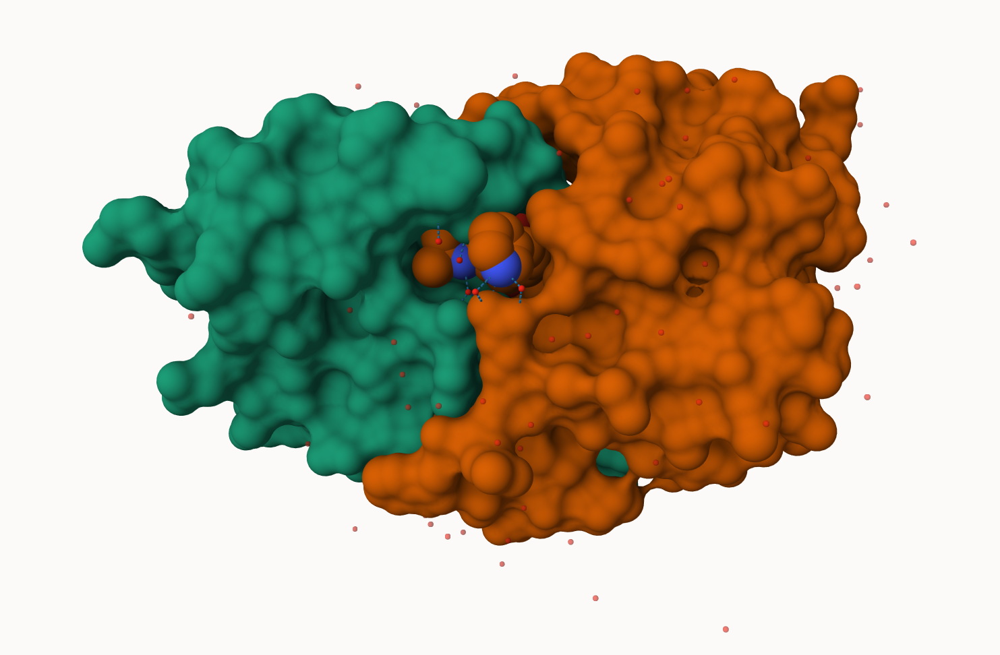

# Class 10 Structural Bioinformatics
Austin Teel (A17293709)

- [Background](#background)
- [PDB Statistics](#pdb-statistics)
- [Visualizing the HIV-1 protease
  structure](#visualizing-the-hiv-1-protease-structure)
- [Using Molstar](#using-molstar)
- [Introduction to BIo3D in R](#introduction-to-bio3d-in-r)
- [Prediction of protein dynamics](#prediction-of-protein-dynamics)
- [Comparative protein structure analysis with
  RNA](#comparative-protein-structure-analysis-with-rna)

## Background

The [Protein Data Bank (PDB)](http://www.rcsb.org/) is the main
repository of main biomecular structure data. Let’s see what is in it:

## PDB Statistics

``` r
Stats <- read.csv("pdb_stats.csv", row.names=1)

head(Stats)
```

                             X.ray    EM   NMR Integrative Multiple.methods Neutron
    Protein (only)          178795 21825 12773         343              226      84
    Protein/Oligosaccharide  10363  3564    34           8               11       1
    Protein/NA                9106  6335   287          24                7       0
    Nucleic acid (only)       3132   221  1566           3               15       3
    Other                      175    25    33           4                0       0
    Oligosaccharide (only)      11     0     6           0                1       0
                            Other  Total
    Protein (only)             32 214078
    Protein/Oligosaccharide     0  13981
    Protein/NA                  0  15759
    Nucleic acid (only)         1   4941
    Other                       0    237
    Oligosaccharide (only)      4     22

> Q1: What percentage of structures in the PDB are solved by X-Ray and
> Electron Microscopy.

``` r
n.sums <- colSums(Stats)
n <- n.sums/n.sums["Total"]
round(n, digits=2)
```

               X.ray               EM              NMR      Integrative 
                0.81             0.13             0.06             0.00 
    Multiple.methods          Neutron            Other            Total 
                0.00             0.00             0.00             1.00 

The percentage of structures in the PDB that are solved by X-ray are 81%
while EM is 13%.

> What is the total number of entries in the PDB

``` r
n.sums["Total"]
```

     Total 
    249018 

The total number of entries is 249,018.

> Q2: What proportion of structures in the PDB are protein?

``` r
r.sums <- rowSums(Stats)
r <- r.sums/n.sums["Total"]
round(r, digits=2)
```

             Protein (only) Protein/Oligosaccharide              Protein/NA 
                       1.72                    0.11                    0.13 
        Nucleic acid (only)                   Other  Oligosaccharide (only) 
                       0.04                    0.00                    0.00 

> Q3: Type HIV in the PDB website search box on the home page and
> determine how many HIV-1 protease structures are in the current PDB?

In the current PDB there are 38 HIV protease structures.

## Visualizing the HIV-1 protease structure

## Using Molstar

We can use the main [Molstar viewer
online](https://molstar.org/viewer/).

 \> Q.
Generate and insert an image of HIV-Pr cartoon colored by secondary
structure, showing the inhibitor (ligand) in ball and stick.

.png)

> Q. Generate a final image showing catalytic APS 25 as ball and stick
> and the all-important active site water molecule as spacefill.

.png)

> Q4: Water molecules normally have 3 atoms. Why do we see just one atom
> per water molecule in this structure?

We only see one water molecule in this structure because the structure
is only showing one atom from this molecule where it is binding or
center of molecule in order to conserve space.

> Q5: There is a critical “conserved” water molecule in the binding
> site. Can you identify this water molecule? What residue number does
> this water molecule have?

The water molecule is displayed in the picture above and the residue
number of this water molecule is Water 308.

> Q6: Generate and save a figure clearly showing the two distinct chains
> of HIV-protease along with the ligand. You might also consider showing
> the catalytic residues ASP 25 in each chain and the critical water (we
> recommend “Ball & Stick” for these side-chains). Add this figure to
> your Quarto document.

See photos above.

> Discussion Topic: Can you think of a way in which indinavir, or even
> larger ligands and substrates, could enter the binding site?

## Introduction to BIo3D in R

``` r
library(bio3d)
hiv <- read.pdb("1hsg")
```

      Note: Accessing on-line PDB file

``` r
hiv
```


     Call:  read.pdb(file = "1hsg")

       Total Models#: 1
         Total Atoms#: 1686,  XYZs#: 5058  Chains#: 2  (values: A B)

         Protein Atoms#: 1514  (residues/Calpha atoms#: 198)
         Nucleic acid Atoms#: 0  (residues/phosphate atoms#: 0)

         Non-protein/nucleic Atoms#: 172  (residues: 128)
         Non-protein/nucleic resid values: [ HOH (127), MK1 (1) ]

       Protein sequence:
          PQITLWQRPLVTIKIGGQLKEALLDTGADDTVLEEMSLPGRWKPKMIGGIGGFIKVRQYD
          QILIEICGHKAIGTVLVGPTPVNIIGRNLLTQIGCTLNFPQITLWQRPLVTIKIGGQLKE
          ALLDTGADDTVLEEMSLPGRWKPKMIGGIGGFIKVRQYDQILIEICGHKAIGTVLVGPTP
          VNIIGRNLLTQIGCTLNF

    + attr: atom, xyz, seqres, helix, sheet,
            calpha, remark, call

``` r
head(hiv$atom)
```

      type eleno elety  alt resid chain resno insert      x      y     z o     b
    1 ATOM     1     N <NA>   PRO     A     1   <NA> 29.361 39.686 5.862 1 38.10
    2 ATOM     2    CA <NA>   PRO     A     1   <NA> 30.307 38.663 5.319 1 40.62
    3 ATOM     3     C <NA>   PRO     A     1   <NA> 29.760 38.071 4.022 1 42.64
    4 ATOM     4     O <NA>   PRO     A     1   <NA> 28.600 38.302 3.676 1 43.40
    5 ATOM     5    CB <NA>   PRO     A     1   <NA> 30.508 37.541 6.342 1 37.87
    6 ATOM     6    CG <NA>   PRO     A     1   <NA> 29.296 37.591 7.162 1 38.40
      segid elesy charge
    1  <NA>     N   <NA>
    2  <NA>     C   <NA>
    3  <NA>     C   <NA>
    4  <NA>     O   <NA>
    5  <NA>     C   <NA>
    6  <NA>     C   <NA>

``` r
pdbseq(hiv)
```

      1   2   3   4   5   6   7   8   9  10  11  12  13  14  15  16  17  18  19  20 
    "P" "Q" "I" "T" "L" "W" "Q" "R" "P" "L" "V" "T" "I" "K" "I" "G" "G" "Q" "L" "K" 
     21  22  23  24  25  26  27  28  29  30  31  32  33  34  35  36  37  38  39  40 
    "E" "A" "L" "L" "D" "T" "G" "A" "D" "D" "T" "V" "L" "E" "E" "M" "S" "L" "P" "G" 
     41  42  43  44  45  46  47  48  49  50  51  52  53  54  55  56  57  58  59  60 
    "R" "W" "K" "P" "K" "M" "I" "G" "G" "I" "G" "G" "F" "I" "K" "V" "R" "Q" "Y" "D" 
     61  62  63  64  65  66  67  68  69  70  71  72  73  74  75  76  77  78  79  80 
    "Q" "I" "L" "I" "E" "I" "C" "G" "H" "K" "A" "I" "G" "T" "V" "L" "V" "G" "P" "T" 
     81  82  83  84  85  86  87  88  89  90  91  92  93  94  95  96  97  98  99   1 
    "P" "V" "N" "I" "I" "G" "R" "N" "L" "L" "T" "Q" "I" "G" "C" "T" "L" "N" "F" "P" 
      2   3   4   5   6   7   8   9  10  11  12  13  14  15  16  17  18  19  20  21 
    "Q" "I" "T" "L" "W" "Q" "R" "P" "L" "V" "T" "I" "K" "I" "G" "G" "Q" "L" "K" "E" 
     22  23  24  25  26  27  28  29  30  31  32  33  34  35  36  37  38  39  40  41 
    "A" "L" "L" "D" "T" "G" "A" "D" "D" "T" "V" "L" "E" "E" "M" "S" "L" "P" "G" "R" 
     42  43  44  45  46  47  48  49  50  51  52  53  54  55  56  57  58  59  60  61 
    "W" "K" "P" "K" "M" "I" "G" "G" "I" "G" "G" "F" "I" "K" "V" "R" "Q" "Y" "D" "Q" 
     62  63  64  65  66  67  68  69  70  71  72  73  74  75  76  77  78  79  80  81 
    "I" "L" "I" "E" "I" "C" "G" "H" "K" "A" "I" "G" "T" "V" "L" "V" "G" "P" "T" "P" 
     82  83  84  85  86  87  88  89  90  91  92  93  94  95  96  97  98  99 
    "V" "N" "I" "I" "G" "R" "N" "L" "L" "T" "Q" "I" "G" "C" "T" "L" "N" "F" 

Let’s try out the new **bio3dview** package that is not yet on CRAN. We
can use the **remotes** package to install any R package from GitHub.

``` r
library(bio3dview)

sele <- atom.select(hiv, resno=25)

#view.pdb(hiv, backgroundColor="lightblue",
        #highlight=sele, highlight.style="spacefill")
```

> Q7: How many amino acid residues are there in this pdb object?

There are 198 amino acids and this can be found from CAlpha atoms.

> Q8: Name one of the two non-protein residues?

Two non protein residues are HOH (127) and MK1 (1).

> Q9: How many protein chains are in this structure?

There are 2 protein chains in this structure.

## Prediction of protein dynamics

``` r
adk <- read.pdb("6s36")
```

      Note: Accessing on-line PDB file
       PDB has ALT records, taking A only, rm.alt=TRUE

``` r
m <- nma(adk)
```

     Building Hessian...        Done in 0.03 seconds.
     Diagonalizing Hessian...   Done in 0.24 seconds.

``` r
plot(m)
```


write out our results as a wee trajectory movie:

``` r
mktrj(m, file="results.pdb")
```

``` r
#view.nma(m)
```

## Comparative protein structure analysis with RNA

We will start with a database id 1ake_A

``` r
library(bio3d)
id <- "1ake_A"
aa <- get.seq(id)
```

    Warning in get.seq(id): Removing existing file: seqs.fasta

    Fetching... Please wait. Done.

``` r
#blast <- blast.pdb(aa)
```

Have a wee peak:

``` r
#head(blast$hit.tbl)
```

``` r
#hits <- plot(blast)
```

Peak at our “top hits”

``` r
#head(hits$pdb.id)
```

Now we can download these “top hits” these will all be ADK structures in
the PDB database.

``` r
#files <- get.pdb(hits$pdb.id, path="pdbs", split=TRUE, gzip=TRUE)
```

we need one package from BioConductor. To set this up we first need to
first install a package called **“BiocManager”** from CRAN.

Now we can use the `install()` function from this package like this:
`BiocManager::install("msa")`

``` r
#pdbs <- pdbaln(files, fit = TRUE, exefile="msa")
```

Let’s have a wee peak at our structures after “fitting” or superposing:

``` r
#library(bio3dview)

#view.pdbs(pdbs, colorScheme="residue")
```

We can run function like `rmsd()`,`rmsf()`, and the best `pca()`

``` r
#pc.xray <- pca(pdbs)
#plot(pc.xray)
```

``` r
#plot(pc.xray, 1:2)
```

Finally, let’s make a wee movie of the major “motion” or structural
difference in the dataset - we call this a “trajectory”

``` r
#mktrj(pc.xray, file="results.pdb")
```
