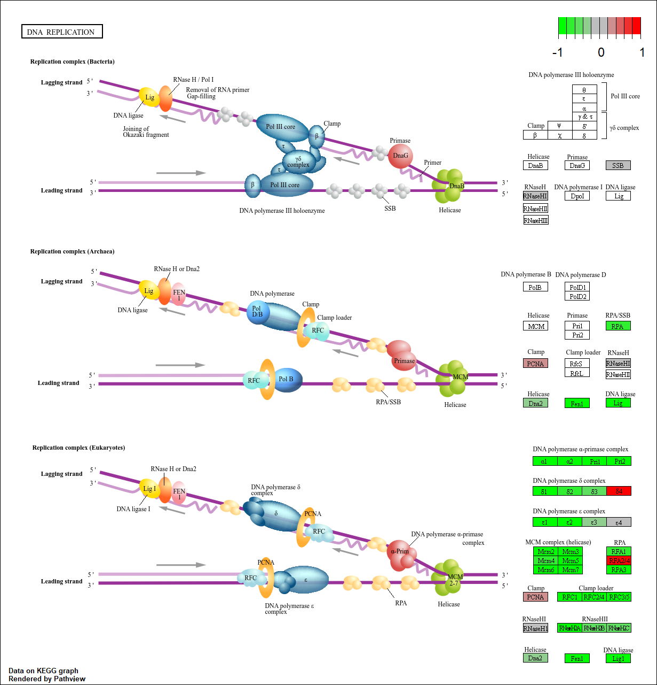
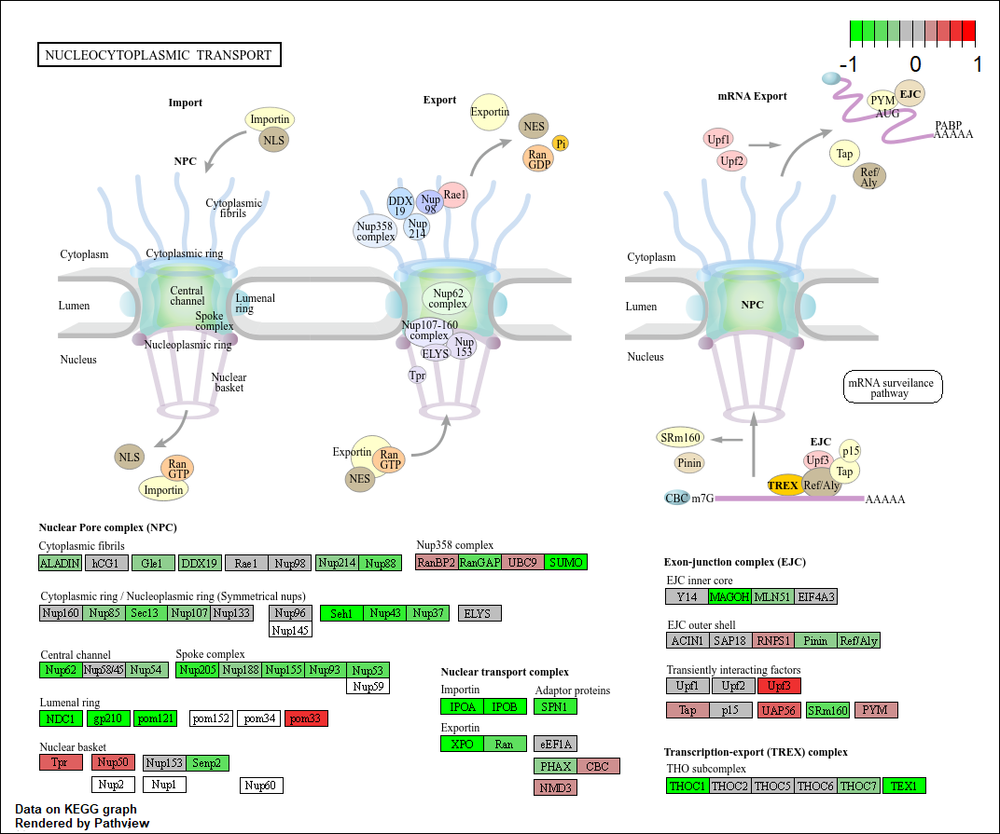
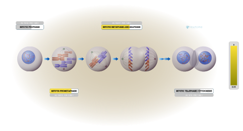

## Background

The data for today's mini-project comes from a knock-down experiment study of an important HOX gene.

##Data Import

```{r}
library(DESeq2)
countFile <- "GSE37704_featurecounts.csv"
metaFile <- "GSE37704_metadata.csv"
```

```{r}
colData = read.csv(metaFile)
countData = read.csv(countFile, row.names=1)
```

```{r}
head(colData)
head(countData)
```

### Clean Up (data tidying)


We need to remove funny "length" column from our `countData` to make the columns match with the rows in the `colData`

> Q. Complete the code below to remove the troublesome first column from countData

```{r}
countData <- countData[,-1]
head(countData)
```
Check match of `colData` and `countData`

```{r}
colData$id == colnames(countData)
```

> Q. Complete the code below to filter countData to exclude genes (i.e. rows) where we have 0 read count across all samples (i.e. columns).

```{r}
countData <- countData[rowSums(countData) != 0, ]
head(countData)
```

## DESeq Analysis
```{r}
library(DESeq2)
```

### setting up the DESeq object
```{r}
dds = DESeqDataSetFromMatrix(countData=countData,
                             colData=colData,
                             design=~condition)
```

### Running DESeq
```{r}
dds = DESeq(dds)
dds
```

### Getting results

> Q. Call the summary() function on your results to get a sense of how many genes are up or down-regulated at the default 0.1 p-value cutoff.

```{r}
res = results(dds)
summary(res)
```

## Volcano plot
```{r}
library(ggplot2)
ggplot(res)+
aes(log2FoldChange,padj)+
geom_point()
```

```{r}
ggplot(res)+
aes(log2FoldChange,-log(padj))+
geom_point()+
geom_vline(xintercept = c(-2,+2), col="red")+
geom_hline(yintercept = -log(0.01), col="red")
```

> Q. Improve this plot by completing the below code, which adds color, axis labels and cutoff lines:

```{r}
mycols <- rep("grey", nrow(res))
mycols[res$log2FoldChange > 2] <- "blue"
mycols[res$log2FoldChange < -2] <- "blue"
mycols[res$padj >= 0.05] <- "grey"
ggplot(res)+
aes(x=log2FoldChange,y=-log(padj))+
geom_point(col=mycols) +
geom_vline(xintercept = c(-2,+2), col="black", lty=2)+
geom_hline(yintercept = -log(0.05), col="black", lty=2)
```

### Annotation

> Q. Use the mapIDs() function multiple times to add SYMBOL, ENTREZID and GENENAME annotation to our results by completing the code below.

```{r}
library("AnnotationDbi")
library("org.Hs.eg.db")

columns(org.Hs.eg.db)

res$symbol = mapIds(org.Hs.eg.db,
                    keys=rownames(res), 
                    keytype="ENSEMBL",
                    column="SYMBOL",
                    multiVals="first")

res$entrez = mapIds(org.Hs.eg.db,
                    keys=rownames(res),
                    keytype="ENSEMBL",
                    column="ENTREZID",
                    multiVals="first")

res$name =   mapIds(org.Hs.eg.db,
                    keys=row.names(res),
                    keytype="ENSEMBL",
                    column="GENENAME",
                    multiVals="first")

head(res, 10)
```

> Q. Finally for this section let's reorder these results by adjusted p-value and save them to a CSV file in your current project directory.

```{r}
res = res[order(res$pvalue),]
write.csv(res, file = "deseq_results.csv")
```

## Pathway Analysis

```{r, message=FALSE}
library(gage)
library(gageData)
library(pathview)
```

```{r}
data(kegg.sets.hs)
data(sigmet.idx.hs)
kegg.sets.hs = kegg.sets.hs[sigmet.idx.hs]
head(kegg.sets.hs, 3)
```
```{r}
foldchanges <- res$log2FoldChange
names(foldchanges) <- res$entrez
head(foldchanges)
```

```{r}
keggres = gage(foldchanges, gsets=kegg.sets.hs)
attributes(keggres)
head(keggres$less)
```

### KEGG


```{r}
pathview(gene.data=foldchanges, pathway.id="hsa04114")

pathview(gene.data=foldchanges, pathway.id="hsa04114", kegg.native=FALSE)
```


```{r}
keggrespathways <- rownames(keggres$less)[1:5]
keggresids = substr(keggrespathways, start=1, stop=8)
keggresids
pathview(gene.data=foldchanges, pathway.id=keggresids, species="hsa")
```


> Q. Can you do the same procedure as above to plot the pathview figures for the top 5 down-regulated pathways?







### GO

```{r}
data(go.sets.hs)
data(go.subs.hs)

gobpsets = go.sets.hs[go.subs.hs$BP]

gobpres = gage(foldchanges, gsets=gobpsets)

lapply(gobpres, head)
```


### Reactome Analysis

```{r}
sig_genes <- res[res$padj <= 0.05 & !is.na(res$padj), "symbol"]
print(paste("Total number of significant genes:", length(sig_genes)))
```

```{r}
write.table(sig_genes, file="significant_genes.txt", row.names=FALSE, col.names=FALSE, quote=FALSE)
```


> Q. What pathway has the most significant “Entities p-value”? Do the most significant pathways listed match your previous KEGG results? What factors could cause differences between the two methods?


The cell cycle process mitotic, the cell cycle, and the checkpoints of the cell cycle have the best p-values for significant entities. While these matches don't match with KEGG this is due to the fact that they use different databases.





